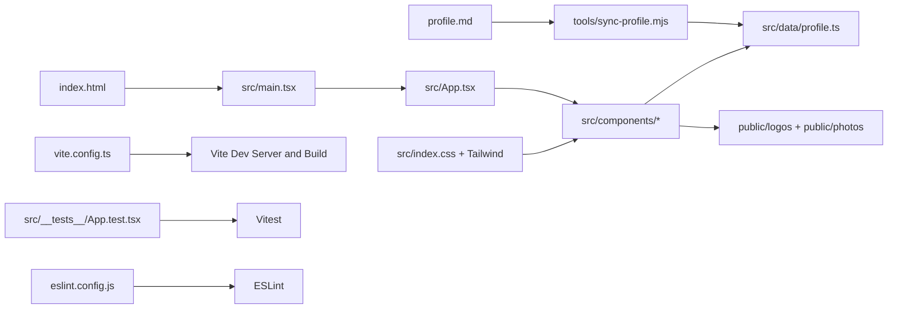

# Architecture Overview

This project is a single-page profile web application built with React, TypeScript, Vite, and Tailwind CSS.

## Architecture Diagram

## Main Architecture Components

| Component | Role in this project | Learn more |
|---|---|---|
| React UI Layer | Renders the profile page layout and sections (sidebar, summary, experience, projects, recommendations). | [React Documentation](https://react.dev/learn) |
| TypeScript Type System | Defines profile data contracts and improves safety in components and tooling scripts. | [TypeScript Handbook](https://www.typescriptlang.org/docs/) |
| Vite Build and Dev Server | Provides fast local development, module bundling, and production builds. | [Vite Guide](https://vite.dev/guide/) |
| Tailwind CSS Styling | Utility-first styling for layout, spacing, typography, and responsive behavior. | [Tailwind CSS Docs](https://tailwindcss.com/docs) |
| Profile Data Model | Central in-memory data object used by UI sections to render content. | [Data file](src/data/profile.ts) |
| Markdown-to-Data Sync Tool | Converts profile.md content into typed profile data for the web app. | [Sync script](tools/sync-profile.mjs) |
| Test Layer (Vitest + Testing Library) | Verifies core render behavior and protects against regressions. | [Vitest Docs](https://vitest.dev/guide/), [Testing Library Docs](https://testing-library.com/docs/react-testing-library/intro/) |
| Lint Layer (ESLint) | Enforces code quality and consistent TypeScript and React rules. | [ESLint Docs](https://eslint.org/docs/latest/) |

## Main Runtime Flow

1. Browser loads [index.html](index.html).
2. [src/main.tsx](src/main.tsx) mounts the React app into the root element.
3. [src/App.tsx](src/App.tsx) composes page sections and layout.
4. UI components consume data from [src/data/profile.ts](src/data/profile.ts).
5. Styling is applied via [src/index.css](src/index.css) and Tailwind utility classes.

## Main Folders

| Folder | Purpose | Typical contents |
|---|---|---|
| [src](src) | Application source code | App shell, UI components, styling, tests, profile data |
| [src/components](src/components) | Reusable page sections | Sidebar, Summary, Experience, Projects, Recommendations, Footer |
| [src/data](src/data) | Typed in-memory content source | profile.ts |
| [src/__tests__](src/__tests__) | Front-end tests | App.test.tsx |
| [public](public) | Static assets served as-is | Logos and profile photo |
| [public/logos](public/logos) | Organization, certification, education logos | .jfif logo files |
| [public/photos](public/photos) | Profile images | Attila.Szabo.small.jpg |
| [tools](tools) | Developer automation scripts | sync-profile.mjs |
| [dist](dist) | Production build output (generated) | bundled HTML/CSS/JS assets |
| [.venv](.venv) | Local Python virtual environment (not part of runtime app) | local tooling environment |
| [.git](.git) | Git repository metadata | commit history and refs |

## Root Files and What They Do

| File | Purpose |
|---|---|
| [.env](.env) | Local environment variables file for developer machine. |
| [.gitignore](.gitignore) | Defines files and folders excluded from Git tracking. |
| [AGENTS.md](AGENTS.md) | Project-level implementation guidance and constraints used during development. |
| [architecture.md](architecture.md) | This architecture document. |
| [eslint.config.js](eslint.config.js) | ESLint flat config for TypeScript and React lint rules. |
| [index.html](index.html) | HTML entry point that hosts the React root element. |
| [package.json](package.json) | Project metadata, scripts, dependencies, and tooling commands. |
| [package-lock.json](package-lock.json) | Exact npm dependency lockfile for reproducible installs. |
| [profile.md](profile.md) | Human-editable profile source content in Markdown. |
| [README.md](README.md) | Setup, run, sync, and quality-check instructions. |
| [tsconfig.json](tsconfig.json) | TypeScript project references root config. |
| [tsconfig.app.json](tsconfig.app.json) | TypeScript compiler settings for app source code. |
| [tsconfig.node.json](tsconfig.node.json) | TypeScript settings for Node-side config files (for example Vite config). |
| [vite.config.ts](vite.config.ts) | Vite dev/build config and Vitest test config. |

## Other Important Files

| File | Why it matters |
|---|---|
| [src/App.tsx](src/App.tsx) | Top-level composition and layout behavior, including print-mode behavior. |
| [src/main.tsx](src/main.tsx) | React bootstrap and app mount point. |
| [src/index.css](src/index.css) | Global design tokens, typography, base styles, and Tailwind import. |
| [src/data/profile.ts](src/data/profile.ts) | Typed content model consumed by all UI sections. |
| [src/components/Sidebar.tsx](src/components/Sidebar.tsx) | Sidebar profile card, quick navigation, expertise, certifications, education, and languages. |
| [src/components/Summary.tsx](src/components/Summary.tsx) | About section rendering. |
| [src/components/Experience.tsx](src/components/Experience.tsx) | Work history rendering with roles and bullets. |
| [src/components/Projects.tsx](src/components/Projects.tsx) | Project cards sorted by recency. |
| [src/components/Recommendations.tsx](src/components/Recommendations.tsx) | Recommendation cards rendering. |
| [src/components/Footer.tsx](src/components/Footer.tsx) | Footer branding line. |
| [src/components/Education.tsx](src/components/Education.tsx) | Reusable education section component (currently not part of main page flow). |
| [src/components/Expertise.tsx](src/components/Expertise.tsx) | Reusable expertise section component (currently not part of main page flow). |
| [src/test-setup.ts](src/test-setup.ts) | Test environment setup for DOM matchers and utilities. |
| [src/__tests__/App.test.tsx](src/__tests__/App.test.tsx) | Smoke and structure tests for core page content. |
| [tools/sync-profile.mjs](tools/sync-profile.mjs) | Converts profile.md into src/data/profile.ts for content updates. |

## Content Update Pipeline

1. Edit [profile.md](profile.md).
2. Run npm script from [package.json](package.json): npm run sync:profile.
3. Script [tools/sync-profile.mjs](tools/sync-profile.mjs) regenerates [src/data/profile.ts](src/data/profile.ts).
4. Run validation commands: npm run lint, npm run test, npm run build.

## Quality and Build Toolchain

- Linting: [eslint.config.js](eslint.config.js) + npm run lint
- Testing: [vite.config.ts](vite.config.ts) test config + npm run test
- Production build: [vite.config.ts](vite.config.ts) + npm run build
